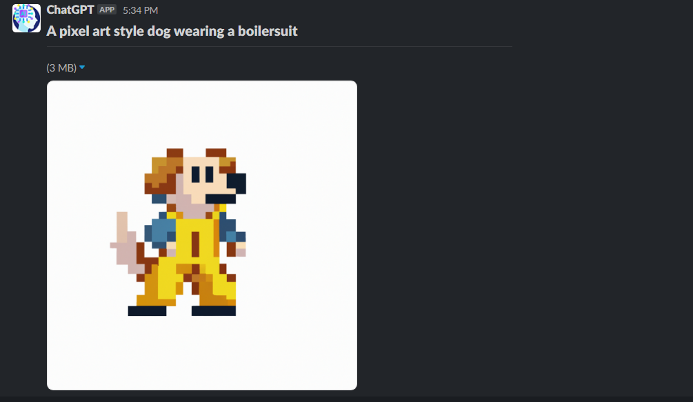

# Alexa With ChatGPT

Deploys an Alexa Skill that integrates Alexa with ChatGPT

Supports sending results to Slack or as Audio output

## Requirements

- [X] Python 3.8
- [X] AWS Account
- [X] OpenAI Account

## Deployment

ask cli automatically deploys the AWS Lambda to your configured AWS Account using the following  
```
ask configure
ask deploy --ignore-hash
```

## 🏁 Environment Variables for Lambdas

The following environment variables **must** be set in the AWS Lambda Environment  

| **Name** | **Description** |
| --- | --- | 
| SLACK_URL |Incoming Webhook Url to send Slack Messages |
| SLACK_CHANNEL | SLack channel to send messages to |
| OPENAI_API_KEY | Api Key for OpenAI |
| OPENAI_API_ORG | Organization for OpenAi |

The following variables are **optional**

| **Name** | **Description** |
| --- | --- | 
| MODEL | OpenAi Model used defaults to `text-davinci-003` |
| TEMPERATURE | Temperature for model defaults to `0.1` |
| MAX_TOKENS | Max Tokens for model defaults to `3000` |
| LOGLEVEL | Level for logger defaults to `INFO` |

## Testing Locally
```shell
npm install --save-dev ask-sdk-local-debug #intall ask-sdk 

ask dialog --locale en-US # Start chat session with Alexa

User > open ai  # open command 
Alexa > ChatGPT here
User > What is the biggest animal ever to have lived?
Alexa > $Response from ChatGPT
```

## Querying ChatGPT

Use your Alexa Trigger Word (default is Alexa) and `open ai` to start the Skill

🗣 > **Alexa open ai**   
🗣 > **Generate** some book names for a short story about a leopard with 19 legs 

## Sending Slack Message

Requests for Slack messages must be prefixed with the below words from [skill.json](skill-package/skill.json)  
> **send, message, slack**

🗣 > **Alexa open ai**   
🗣 > **message** me what is the largest spider ever to have lived in Ireland 

_output sent to slack from chatgpt_


### Image Generation

Image generation can be triggered using the following and results sent to Slack 
> **create, image, imagine, generate an image, generate image**

🗣 > **Alexa open ai**   
🗣 > **create** a pixel art style dog wearing a boilersuit

