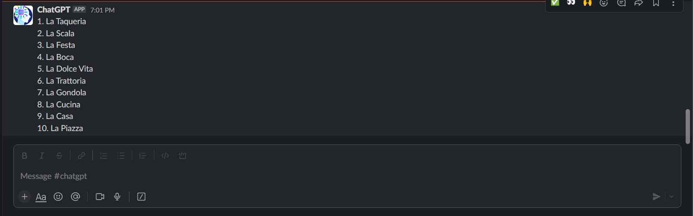

# Alexa With ChatGPT

Deploys an Alexa Skill that integrates Alexa with ChatGPT

Supports sending results to Slack or as Audio output


## 🏁 Environment Variables for Lambdas

The following environment variables must be set in the AWS Lambda Environment  

| **Name** | **Description** |
| --- | --- | 
| SLACK_URL |Incoming Webhook Url to send Slack Messages |
| OPENAI_API_KEY | Api Key for OpenAI |
| OPENAI_API_ORG | Organization for OpenAi |

## Deployment

ask cli automatically deploys the lambda to your configured AWS Account using the following  
```
ask configure
ask deploy --ignore-hash
```

## Testing Locally
```shell
npm install --save-dev ask-sdk-local-debug
ask dialog --locale en-US
> open ai 
> What is the biggest animal ever to have lived?
> $Response from ChatGPT
```

## Querying ChatGPT

Use your Alexa Trigger Word (default is Alexa) and `open ai` to start the Skill

🗣 > **Alexa open ai**   
🗣 > **Generate** some book names for a short story about a leopard with 19 legs 

## Sending Slack Message

Requests for Slack messages must be prefixed with the below words from [skill.json](skill-package/skill.json)  
> **send, message, slack**

🗣 > **Alexa open ai**   
🗣 > **slack** me the top 10 italian restaurants in Belfast  

_output sent to slack from chatgpt_
